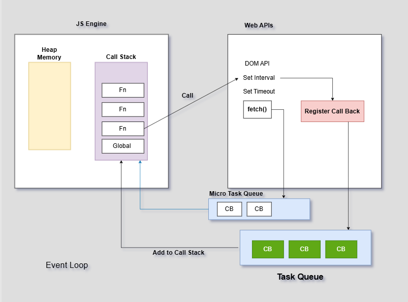

# JavaScript-Learning-2025
A hands-on JavaScript learning project for 2025 using GitHub Codespaces. Practice coding, explore JS concepts, and build real-time JavaScript apps directly in a cloud-based development environment.

Motto: Learn and Build Something to Boost Your Development Journey.

### V8 Engine and Web APIs 
